# elementary OS on Raspberry Pi 4

⚠️ **The builds are not officialy supported by the elementary project** ⚠️

To download the official version visit [https://elementary.io/](https://elementary.io/)

- [Special thanks](#special-thanks)
- [Download](#download)
- [Installation](#installation)
- [Known Issues](#known-issues)
- [Support](#support)
- [Building Locally](#building-locally)

## Special thanks

The builds are based on the work of James A. Chambers alias [TheRemote](https://github.com/TheRemote).

He has documented his work at https://jamesachambers.com/raspberry-pi-ubuntu-server-18-04-2-installation-guide/. He also made his builds available at https://github.com/TheRemote/Ubuntu-Server-raspi4-unofficial.

Also thanks to Marius Meisenzahl [@msnzhl](https://github.com/meisenzahl), the original author of this project available here: https://github.com/meisenzahl/elementary-os-unofficial.

## Download

Download the latest unofficial release for Raspberry Pi 4 from:

* https://github.com/Jiab77/elementary-os-unofficial/releases (_updated releases_)
* https://github.com/meisenzahl/elementary-os-unofficial/releases (_original releases_)

## Installation

As recommended by the Raspberry Pi Foundation use [balenaEtcher](https://www.balena.io/etcher/)
to flash the image to a SD card. The SD card should be at least 8 GB in size.

> The __Gnome Disk__ tool can also be used to flash the image on the SD card.
>
> You can install it from the package `gnome-disk-utility`.

After you booted your Raspberry Pi 4 you are welcomed by the new [Initial Setup](https://github.com/elementary/initial-setup) process.

First you have to choose your language.

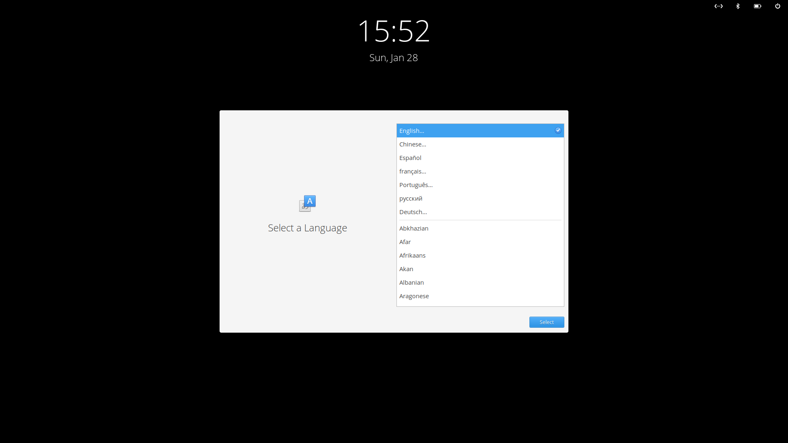

Then you configure your keyboard layout.

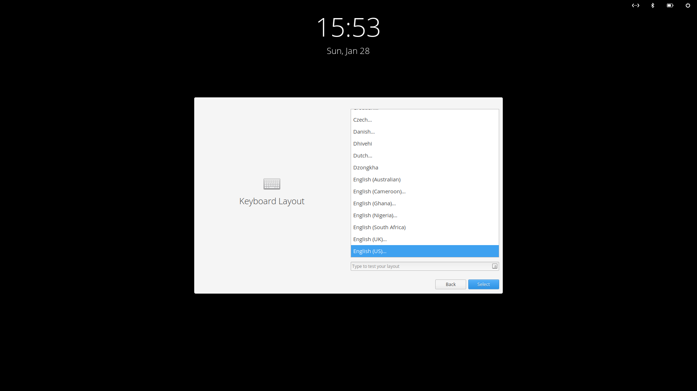

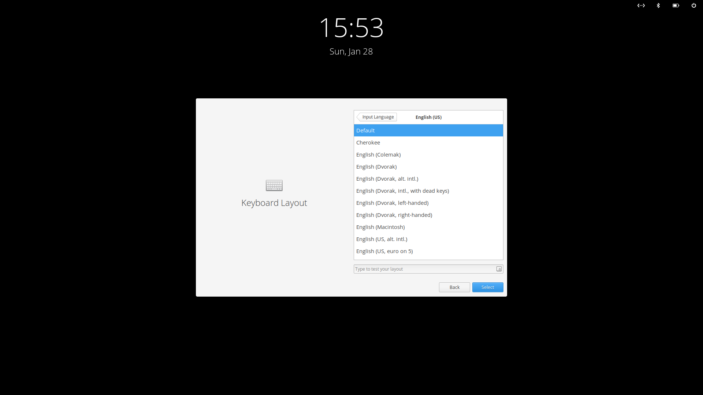

Now it's time to create an account.

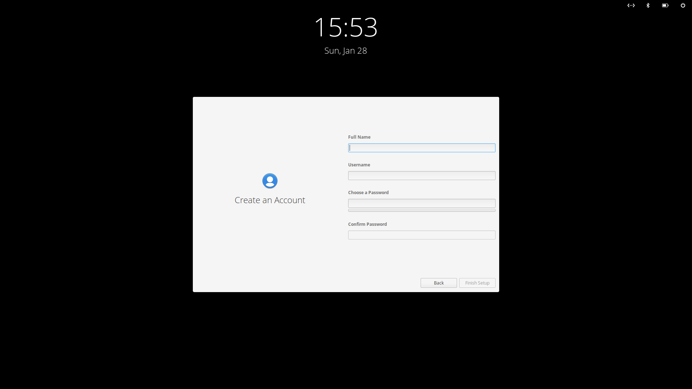

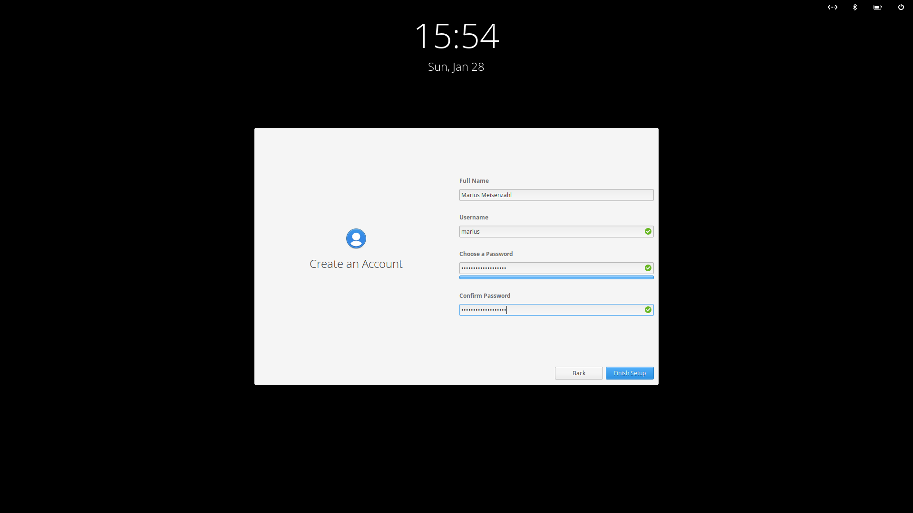

After you click **Finish Setup** you are welcomed by the new [Greeter](https://github.com/elementary/greeter).

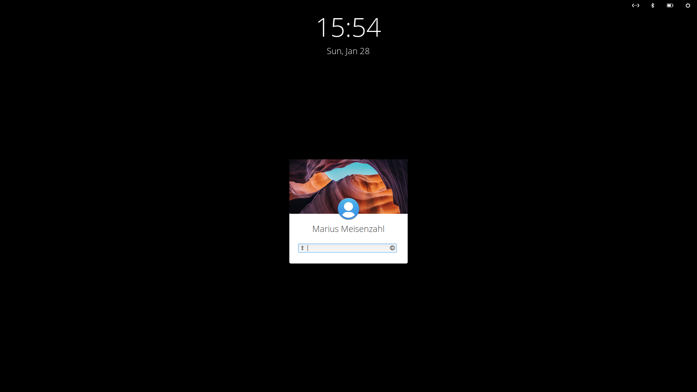

When you login you get your beloved elementary OS desktop.

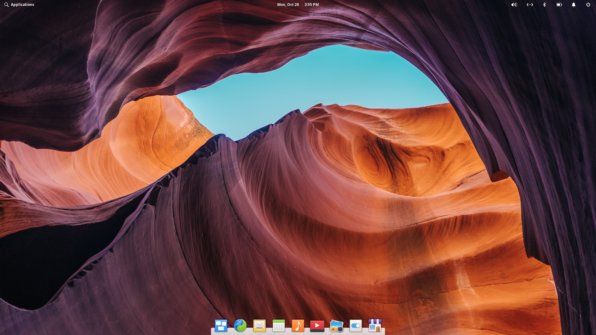

If you open **About** in **System Settings** you see that you are running on a Raspberry Pi.
Mine has 4 GB of RAM.

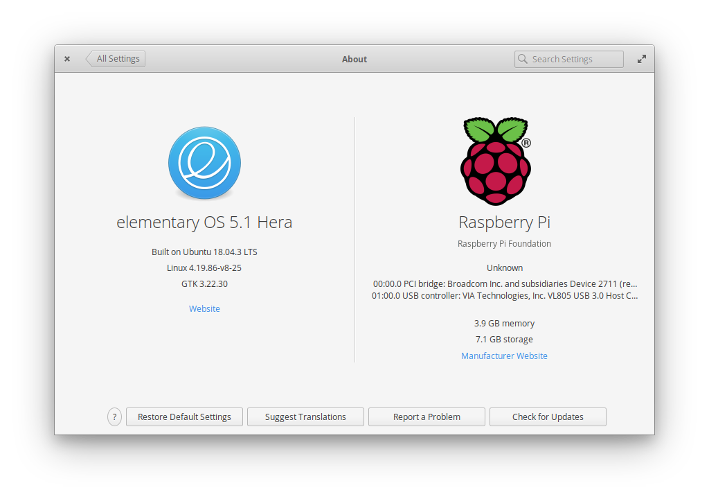

The initial size for the operating system can be increased.
`raspi-config` is available for this purpose.

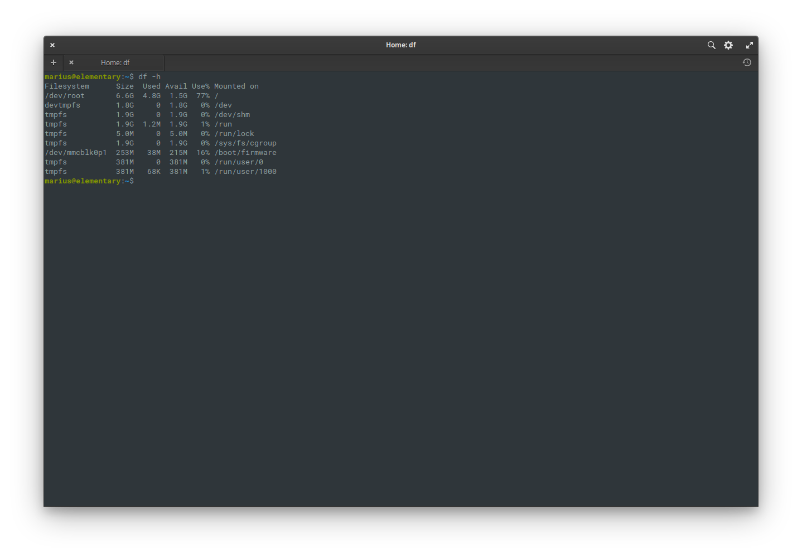

For this you have to start `raspi-config` with root privileges.

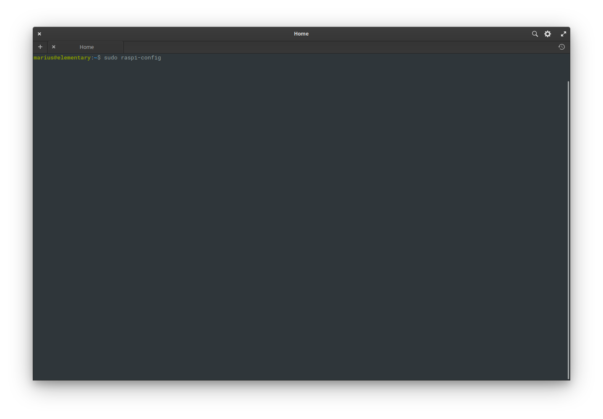

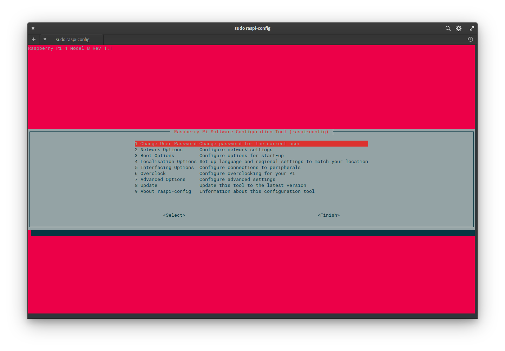

Choose `7 Advanced Options - Configure advanced settings`.

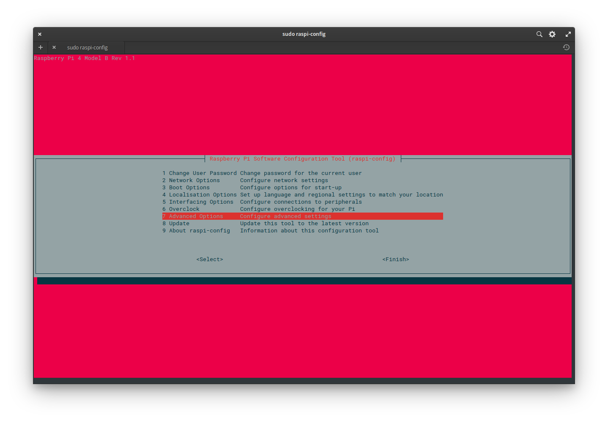

Choose `A1 Expand Filesystem - Ensures that all of the SD card storage is available to the OS`.

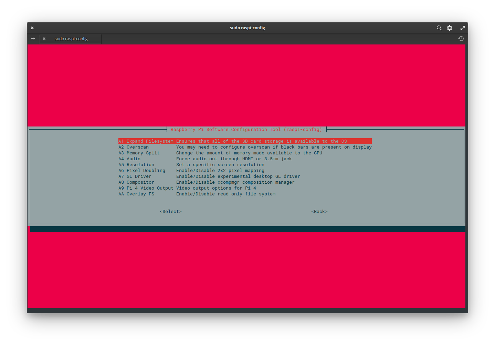

You have to reboot to enlarge your filesystem.

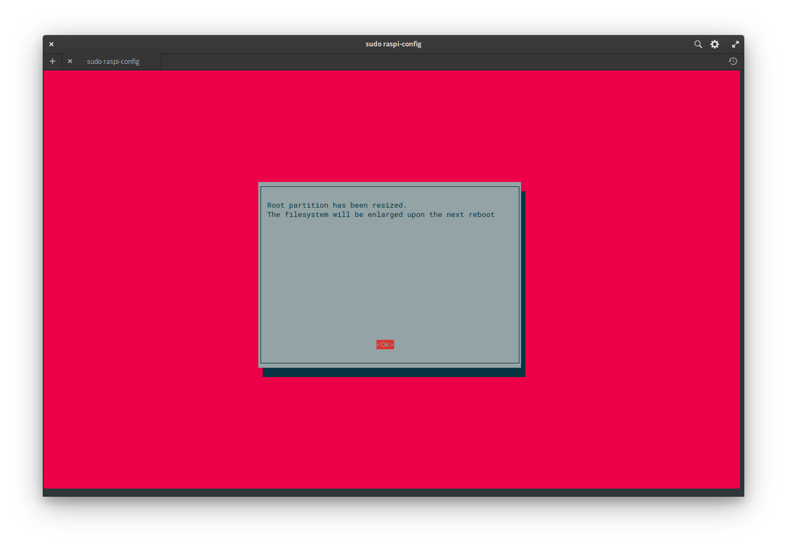

So choose to reboot now.

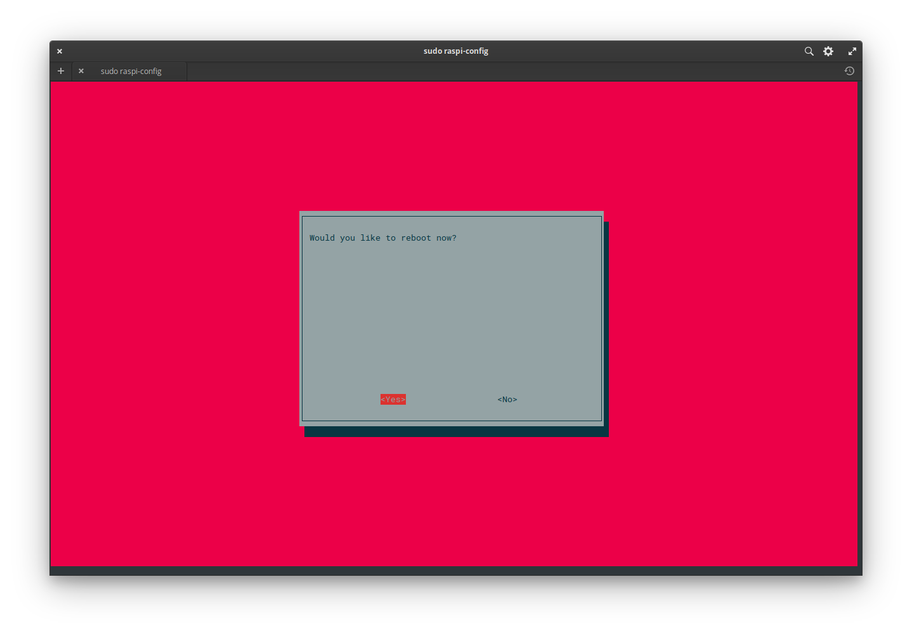

After your Raspberry Pi 4 has booted up you can see that all storage is used.

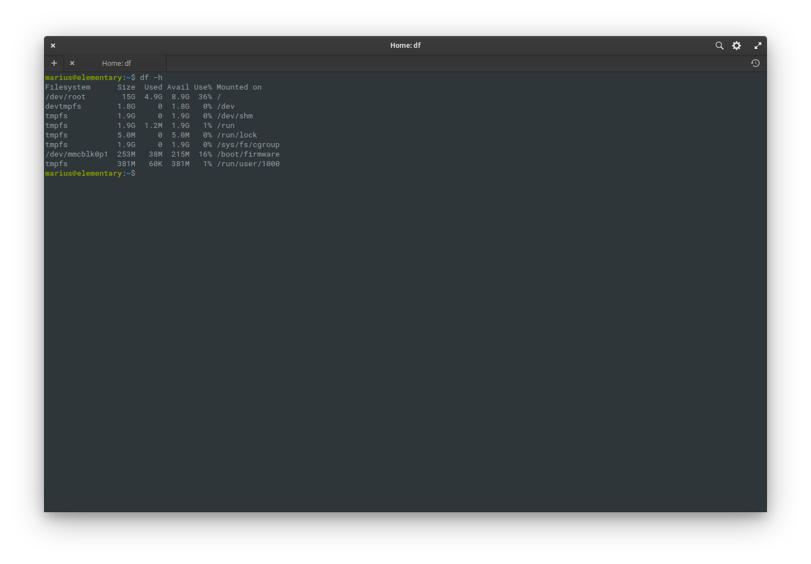

## Known Issues

- [ ] Graphics are only partly hardware accelerated.
- [ ] 4k videos cannot be played.
- [ ] Settings for sound are not saved across a boot.
- [X] Wireless country setting hardcoded to `US`.
- [X] Missing `DTB` drivers that make `flash-kernel` package not upgradable.
- [X] Missing `ssh` keys.

## Support

If you come across a problem open an [issue](https://github.com/Jiab77/elementary-os-unofficial/issues).

## Building Locally

The following example uses Docker and assumes you have Docker correctly installed and set up:

1. Edit the `build.sh` script and define the `COUNTRY` variable to your country code.
   * Example: US, GB, FR, CH, BE...

2. Run the build script:

    ```
    mkdir -pv images
    time docker run --privileged -i \
        -v /proc:/proc \
        -v ${PWD}/images:/images \
        -v ${PWD}:/working_dir \
        -w /working_dir \
        debian:latest \
        ./build.sh
    ```

    > To build with the latest base image, change the build script from `build.sh` to `build-latest.sh`

3.  When done, your image will be in the `images` folder.
